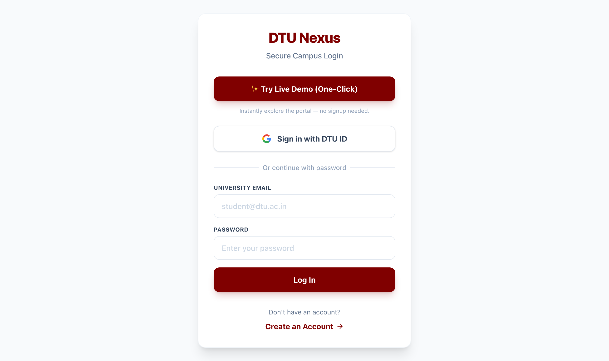

# DTU Nexus 🏛️

The unified campus portal for **Delhi Technological University** — connecting students, faculty, and societies in one seamless platform.

### 🔗 Live: **[dtu-nexus.vercel.app](https://dtu-nexus.vercel.app)**



> **🔎 Reviewing this project?** Open **[the live demo](https://dtu-nexus.vercel.app)** and click **"✨ Try Live Demo (One-Click)"** on the login screen. No signup needed — it drops you straight into a fully seeded portal.

## ✨ Features

- **Campus Feed** — official notices, society announcements, achievements, anonymous grievances, upvotes & comments.
- **Marketplace** — post gigs / internships / project collabs, apply to them, and manage applicants.
- **Utilities** — Lost & Found board with contact details.
- **Profiles** — verified student portfolios with editable bio, branch, semester, etc.
- **Role-based access** — `student`, `club_admin`, `professor`, `admin` with different posting permissions.

## 🏗️ Tech Stack

- **Next.js 16** (App Router) + **React 19**
- **NextAuth v5** (Google OAuth + Credentials)
- **MongoDB + Mongoose**
- **Tailwind CSS v4** + Lucide Icons
- Deployed on **Vercel**, database on **MongoDB Atlas**

---

## 🚀 Running locally

### 1. Prerequisites
- Node.js 18+
- A MongoDB database (local `mongod`, or a free [MongoDB Atlas](https://www.mongodb.com/atlas) cluster)

### 2. Environment
```bash
cp .env.example .env.local
# then fill in MONGODB_URI, AUTH_SECRET (openssl rand -base64 32) and NEXTAUTH_URL
```

### 3. Install & run
```bash
npm install
npm run dev
```
App runs at `http://localhost:3000`.

### 4. Seed the database
Visit **`http://localhost:3000/api/seed`** once to populate demo users, posts, gigs, and lost-and-found items.

### 5. Log in
- Click **"Try Live Demo (One-Click)"**, or
- Use the demo credentials: `demo@dtu.ac.in` / `demo1234`

---

## ☁️ Deploying to Vercel

1. Push this repo to GitHub (already done).
2. Create a free **MongoDB Atlas** M0 cluster, add a database user, and allow access from anywhere (`0.0.0.0/0`). Copy the SRV connection string.
3. Import the repo on [vercel.com/new](https://vercel.com/new).
4. Add environment variables in the Vercel project settings:
   | Key | Value |
   |-----|-------|
   | `MONGODB_URI` | your Atlas SRV string (with `/dtu-nexus` db name) |
   | `AUTH_SECRET` | `openssl rand -base64 32` |
   | `NEXTAUTH_URL` | `https://<your-app>.vercel.app` |
   | `GOOGLE_CLIENT_ID` / `GOOGLE_CLIENT_SECRET` | *(optional — only for real Google login)* |
5. Deploy, then hit `https://<your-app>.vercel.app/api/seed` once to seed production data.

> **Note on Google login:** real Google sign-in is gated to `@dtu.ac.in` emails. For demos, use the one-click Demo Login (credentials-based) — it needs no Google setup.
